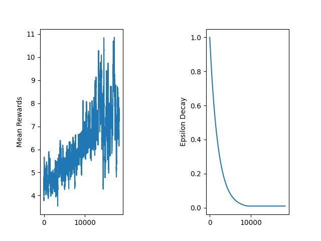
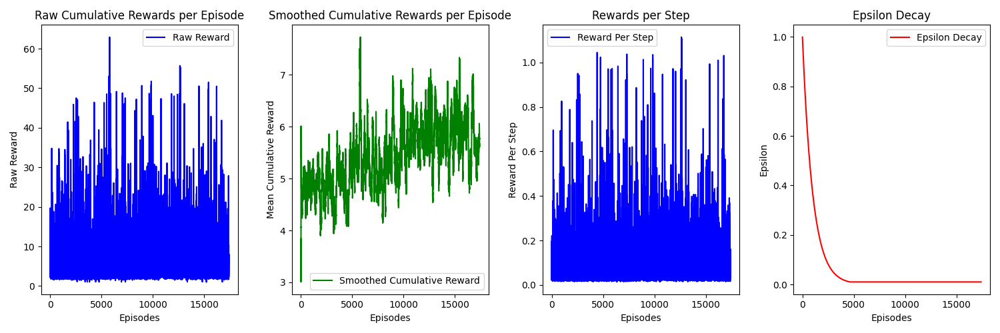
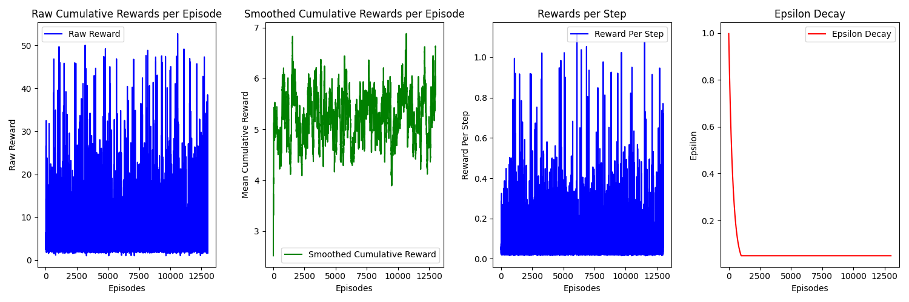
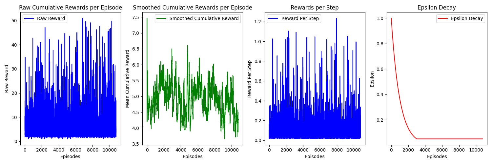
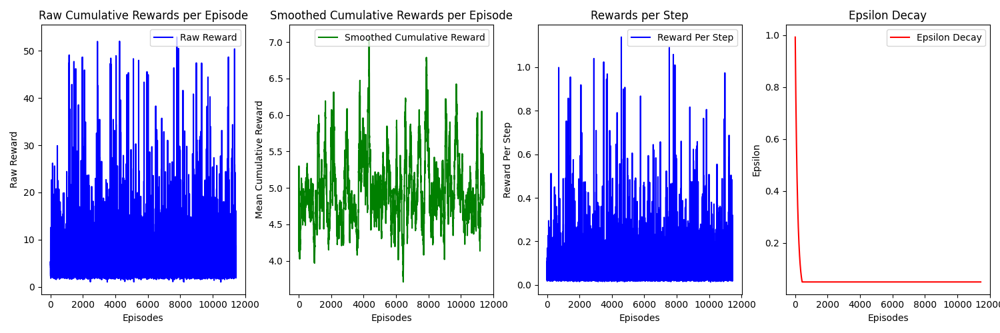
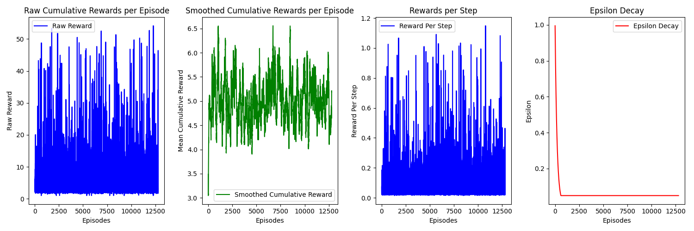
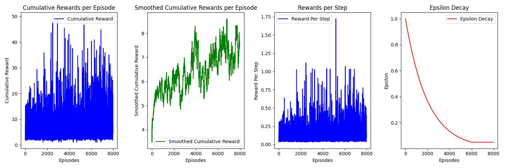

# CMPE591 Homework 2

In this homework, I used a neural netowork with two fully connected hidden layers to estimate Q values of actions given state. Structure of the network is defined in dqn.py. experience_replay.py contains memory operations for replaying. hw2env.py is the file that is given. agent.py file contains reinforcement learning operations. I applied Approximated Q-Learning with epsilon-greedy action selection, experiance replay and weight freezing. Size of the hidden layers deterimned according to parameters. The models are saved as their reward increases.

The code is based on tutorial series: https://github.com/johnnycode8/dqn_pytorch/tree/main

To test the learnt model(1-9), run:
python agent.py

To test the learnt model(10-11), please remove one layer of the network by commenting lines 13 and 21 of dqn.py and run:
python agent.py

To start a training session, uncomment line 358 of agent.py.

Below are the rewards over episodes from agents trained with eight different parameter sets. Respective parameters can be seen in hyperparameters.yml. I have used Relu activation function with parameter sets 1-5 and 8-11, and sigmoid activation functions with parameter sets 5-7. Agents with parameter sets 1-9 have 2 hidden layers, while 10-11 has a single hidden layer. I included a parameter norm penalty with the agents 10-11. Agents 9-11 are trained train_num_per_episode times at each episode. Except for the set 1, reward, smoothed reward, reward per step and value of epsilon over episodes are shown in figures. For set 1, reward and value of epsilon are presented. Agents 9 and 11 performed best.

### Parameter set 1:

  learning_rate_a: 0.001
  gamma: 0.99
  network_sync_rate: 100
  replay_memory_size: 100000
  mini_batch_size: 64
  epsilon_init: 1
  epsilon_decay: 0.9995
  epsilon_min: 0.01
  hidden_layer_dim: 8
  num_actions: 8
  num_states: 6
  

### Parameter set 2:

  learning_rate_a: 0.001
  gamma: 0.99
  network_sync_rate: 50
  replay_memory_size: 10000
  mini_batch_size: 64
  epsilon_init: 1
  epsilon_decay: 0.999
  epsilon_min: 0.01
  hidden_layer_dim: 12
  num_actions: 8
  num_states: 6
  

### Parameter set 3:

  learning_rate_a: 0.002
  gamma: 0.99
  network_sync_rate: 50
  replay_memory_size: 10000
  mini_batch_size: 64
  epsilon_init: 1
  epsilon_decay: 0.997
  epsilon_min: 0.05
  hidden_layer_dim: 16
  num_actions: 8
  num_states: 6
  

### Parameter set 4:

  learning_rate_a: 0.005
  gamma: 0.99
  network_sync_rate: 50
  replay_memory_size: 10000
  mini_batch_size: 64
  epsilon_init: 1
  epsilon_decay: 0.999
  epsilon_min: 0.05
  hidden_layer_dim: 32
  num_actions: 8
  num_states: 6
  

### Parameter set 5:

  learning_rate_a: 0.002
  gamma: 0.99
  network_sync_rate: 50
  replay_memory_size: 10000
  mini_batch_size: 64
  epsilon_init: 1
  epsilon_decay: 0.999
  epsilon_min: 0.05
  hidden_layer_dim: 16
  num_actions: 8
  num_states: 6
  

### Parameter set 6:

  learning_rate_a: 0.002
  gamma: 0.99
  network_sync_rate: 50
  replay_memory_size: 10000
  mini_batch_size: 64
  epsilon_init: 1
  epsilon_decay: 0.993
  epsilon_min: 0.05
  hidden_layer_dim: 16
  num_actions: 8
  num_states: 6
  

### Parameter set 7:

  learning_rate_a: 0.002
  gamma: 0.99
  network_sync_rate: 75
  replay_memory_size: 10000
  mini_batch_size: 64
  epsilon_init: 1
  epsilon_decay: 0.995
  epsilon_min: 0.05
  hidden_layer_dim: 4
  num_actions: 8
  num_states: 6
  

### Parameter set 8:

  learning_rate_a: 0.001
  gamma: 0.99
  network_sync_rate: 200
  replay_memory_size: 10000
  mini_batch_size: 64
  epsilon_init: 1
  epsilon_decay: 0.9995
  epsilon_min: 0.05
  hidden_layer_dim: 64
  num_actions: 8
  num_states: 6
  

### Parameter set 9:

  learning_rate_a: 0.001
  gamma: 0.97
  network_sync_rate: 300
  replay_memory_size: 25000
  mini_batch_size: 128
  epsilon_init: 1
  epsilon_decay: 0.9995
  epsilon_min: 0.05
  hidden_layer_dim: 64
  num_actions: 8
  num_states: 6
  train_num_per_episode: 15
  

### Parameter set 10:

  learning_rate_a: 0.001
  gamma: 0.99
  network_sync_rate: 300
  replay_memory_size: 25000
  mini_batch_size: 64
  epsilon_init: 1
  epsilon_decay: 0.9995
  epsilon_min: 0.05
  hidden_layer_dim: 64
  num_actions: 8
  num_states: 6
  train_num_per_episode: 1
  

### Parameter set 11:

  learning_rate_a: 0.001
  gamma: 0.99
  network_sync_rate: 300
  replay_memory_size: 25000
  mini_batch_size: 64
  epsilon_init: 1
  epsilon_decay: 0.9995
  epsilon_min: 0.05
  hidden_layer_dim: 64
  num_actions: 8
  num_states: 6
  train_num_per_episode: 15
  

Upon training for 18 to 54 hours, only the agent with parameter sets 9 and 11 outperformed the others. This suggests more than one gradient calculations at each episode might help to increase the peformance. Training of 9 and 11 continues to this day.

